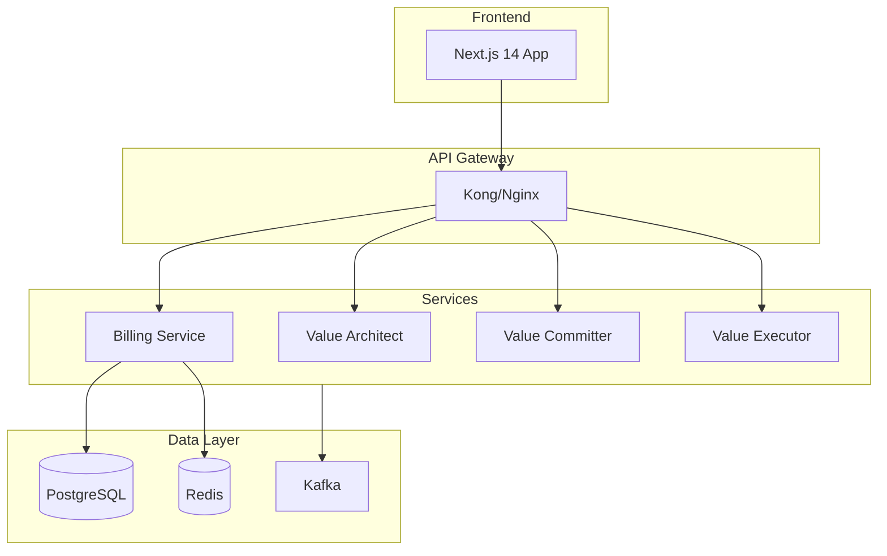

# ValueVerse Platform

[](https://github.com/valueverse/platform/actions)
[](https://github.com/valueverse/platform/actions)
[](https://codecov.io/gh/valueverse/platform)

## 🏗️ Architecture Overview

ValueVerse is a multi-tenant enterprise platform for billing, subscription management, and value modeling with government-grade security.

### System Components



## 🚀 Quick Start

### Prerequisites
- Docker & Docker Compose
- Node.js 18+
- Python 3.11+
- PostgreSQL 15+
- Redis 7+

### Development Setup

```bash
# Clone repository
git clone https://github.com/valueverse/platform.git
cd platform

# Install dependencies
make setup

# Start services
make dev

# Run tests
make test

# View logs
make logs
```

### Service Ports

| Service | Port | Description | Owner |
|---------|------|-------------|-------|
| Frontend | 3000 | Next.js application | UI Team |
| Billing API | 8000 | Subscription & billing | Platform Team |
| Value Architect | 8001 | Model creation | Analytics Team |
| Value Committer | 8002 | Model persistence | Analytics Team |
| Value Executor | 8003 | Model execution | Analytics Team |
| PostgreSQL | 5432 | Primary database | Platform Team |
| Redis | 6379 | Cache & sessions | Platform Team |
| Kafka | 9092 | Event streaming | Platform Team |

## 🔒 Security

### Authentication & Authorization
- **JWT-based authentication** with RS256 signing
- **Multi-tenant isolation** enforced at all layers
- **Row-Level Security (RLS)** in PostgreSQL
- **Rate limiting**: 100 req/min per tenant
- **Session management**: 30-minute timeout with refresh

### Data Protection
- **Encryption at rest**: AES-256-GCM
- **Encryption in transit**: TLS 1.3 minimum
- **Secrets management**: HashiCorp Vault / K8s Secrets
- **PCI DSS compliant** tokenization
- **GDPR compliant** with automated workflows

### Security Headers
```
Content-Security-Policy: default-src 'self'
X-Frame-Options: DENY
X-Content-Type-Options: nosniff
Strict-Transport-Security: max-age=31536000; includeSubDomains
```

## 📊 Monitoring & Observability

### Logging
- Structured JSON logging to stdout
- Centralized in DataDog/CloudWatch
- Correlation IDs for request tracing

### Metrics
- Application metrics via Prometheus
- Business metrics via custom dashboards
- SLO monitoring: 99.9% uptime target

### Alerting
- PagerDuty integration for critical alerts
- Slack notifications for warnings
- Email digests for daily summaries

### Distributed Tracing
- OpenTelemetry instrumentation
- Jaeger/Zipkin for trace visualization
- Automatic trace propagation

## 🧪 Testing

### Test Coverage Requirements
- **Unit tests**: 80% minimum
- **Integration tests**: Critical paths
- **E2E tests**: User journeys
- **Security tests**: OWASP Top 10
- **Performance tests**: Load testing with k6

### Running Tests

```bash
# All tests
make test

# Unit tests only
make test-unit

# Integration tests
make test-integration

# Security tests
make test-security

# Performance tests
make test-performance
```

## 📁 Project Structure

```
valueverse-platform/
├── .github/              # GitHub Actions workflows
├── frontend/             # Next.js application
│   ├── app/             # App router pages
│   ├── components/      # React components
│   ├── services/        # API clients
│   └── tests/          # Frontend tests
├── billing-system/       # Billing microservice
│   ├── backend/        # FastAPI application
│   ├── migrations/     # Database migrations
│   └── tests/         # Service tests
├── services/            # Value modeling services
│   ├── value-architect/
│   ├── value-committer/
│   └── value-executor/
├── infrastructure/      # IaC and K8s manifests
│   ├── terraform/      # Cloud resources
│   ├── kubernetes/     # K8s deployments
│   └── helm/          # Helm charts
├── docs/               # Documentation
│   ├── architecture/   # Architecture decisions
│   ├── api/           # API specifications
│   └── runbooks/      # Operational guides
└── scripts/           # Utility scripts
```

## 🚢 Deployment

### Environments

| Environment | Branch | URL | Purpose |
|------------|--------|-----|---------|
| Development | develop | https://dev.valueverse.ai | Development testing |
| Staging | staging | https://staging.valueverse.ai | Pre-production |
| Production | main | https://app.valueverse.ai | Live system |

### Deployment Process

```bash
# Deploy to staging
make deploy ENV=staging

# Run smoke tests
make test-smoke ENV=staging

# Deploy to production
make deploy ENV=production

# Rollback if needed
make rollback ENV=production
```

## 📈 Performance

### SLOs (Service Level Objectives)
- **Availability**: 99.9% uptime
- **Latency**: p95 < 200ms, p99 < 500ms
- **Error rate**: < 0.1%
- **Throughput**: 10,000 req/sec

### Optimization
- Database query optimization with indexes
- Redis caching for hot data
- CDN for static assets
- Connection pooling
- Async processing via Kafka

## 🛡️ Compliance

### Standards
- **SOC 2 Type II** (in progress)
- **ISO 27001** (planned)
- **GDPR** compliant
- **CCPA** compliant
- **PCI DSS** Level 1

### Audit Trails
- All API calls logged
- Database changes tracked
- User actions recorded
- Immutable audit log with hash-chaining

## 👥 Team & Support

### Code Owners
- **Platform Team**: @platform-team
- **Security Team**: @security-team
- **UI Team**: @ui-team
- **Analytics Team**: @analytics-team

### Support Channels
- **Slack**: #valueverse-support
- **Email**: support@valueverse.ai
- **On-call**: PagerDuty rotation

### Escalation Path

| Severity | Response Time | Escalation |
|----------|--------------|------------|
| Critical | 15 minutes | CTO + Security Lead |
| High | 1 hour | Engineering Manager |
| Medium | 4 hours | Tech Lead |
| Low | 24 hours | On-call Engineer |

## 📚 Documentation

- [Architecture Guide](./docs/architecture/README.md)
- [API Documentation](./docs/api/README.md)
- [Security Policies](./docs/security/README.md)
- [Runbooks](./docs/runbooks/README.md)
- [Contributing Guide](./CONTRIBUTING.md)

## 🔄 CI/CD

### Pipeline Stages
1. **Lint & Format**: Code quality checks
2. **Type Check**: TypeScript/mypy validation
3. **Unit Tests**: Component testing
4. **Integration Tests**: Service testing
5. **Security Scan**: SAST/DAST/dependency scanning
6. **Build**: Docker image creation
7. **Deploy**: Environment deployment
8. **Smoke Tests**: Post-deployment validation

### Branch Protection
- Main branch protected
- Requires PR approval
- Must pass all CI checks
- No force pushes
- Automated security scanning

## 📝 License

Copyright © 2024 ValueVerse. All rights reserved.

---

**Last Updated**: October 26, 2024  
**Version**: 1.0.0  
**Status**: Production Ready (after security fixes)
