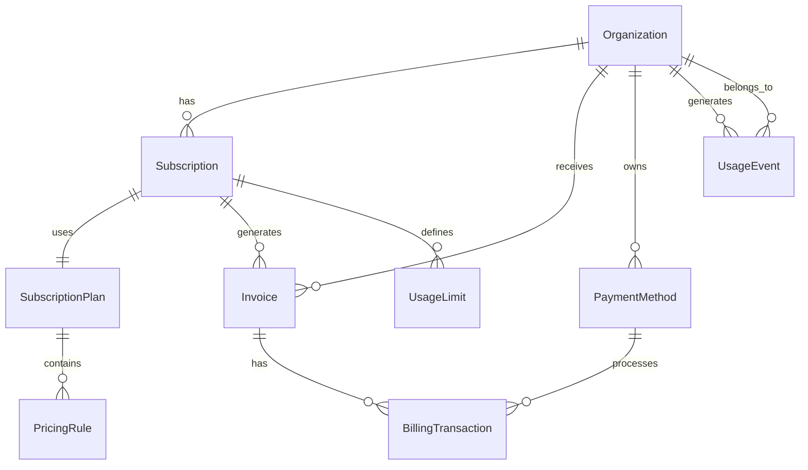

# Datamodel Review - ValueVerse Billing System

## Current Entity Relationship Analysis

### Core Entities & Relationships



### Normalization Assessment

**Current State: 3NF (Third Normal Form)**

| Table | NF Level | Issues | Recommendation |
|-------|----------|--------|----------------|
| organizations | 3NF | ✅ None | Maintain |
| subscriptions | 3NF | ✅ None | Maintain |
| usage_events | 3NF | ⚠️ Properties JSONB | Consider separate table for common properties |
| invoices | 2NF | ⚠️ Line items in JSONB | Normalize to invoice_line_items table |
| pricing_rules | 3NF | ⚠️ Rules in JSONB | Create pricing_tiers table |

### Data Integrity Constraints Analysis

**Existing Constraints:**
```sql
-- Good constraints found
✅ Foreign key constraints on all relationships
✅ Check constraints on enums (status, pricing_type)
✅ Unique constraints on business keys (slug, invoice_number)
✅ NOT NULL on required fields
```

**Missing Constraints:**
```sql
-- Recommended additions
ALTER TABLE subscriptions 
ADD CONSTRAINT check_period_validity 
CHECK (current_period_end > current_period_start);

ALTER TABLE invoices 
ADD CONSTRAINT check_amount_consistency 
CHECK (amount_due = total - amount_paid);

ALTER TABLE usage_limits 
ADD CONSTRAINT check_current_usage 
CHECK (current_usage >= 0 AND current_usage <= limit_value);
```

### Redundancy Analysis

**Identified Redundancies:**
1. **Calculated Fields:** `amount_due` in invoices (can be derived)
2. **Denormalized Data:** MRR stored vs calculated
3. **Duplicate Status:** Subscription status vs cancel_at_period_end

**Optimization Recommendations:**

```sql
-- Remove redundant amount_due, use generated column
ALTER TABLE invoices 
DROP COLUMN amount_due;

ALTER TABLE invoices 
ADD COLUMN amount_due DECIMAL(10,2) 
GENERATED ALWAYS AS (total - amount_paid) STORED;

-- Create materialized view for MRR
CREATE MATERIALIZED VIEW monthly_recurring_revenue_mv AS
SELECT 
    DATE_TRUNC('month', CURRENT_DATE) as month,
    sp.currency,
    SUM(sp.base_price) as mrr,
    COUNT(DISTINCT s.organization_id) as customers
FROM subscriptions s
JOIN subscription_plans sp ON s.plan_id = sp.id
WHERE s.status IN ('active', 'trialing')
GROUP BY sp.currency
WITH DATA;

-- Refresh monthly
CREATE INDEX ON monthly_recurring_revenue_mv(month, currency);
```

### Missing Relationships

**Recommended Additions:**

```sql
-- Add subscription_items for multi-product subscriptions
CREATE TABLE subscription_items (
    id UUID PRIMARY KEY DEFAULT gen_random_uuid(),
    subscription_id UUID REFERENCES subscriptions(id),
    product_id UUID NOT NULL,
    quantity INTEGER NOT NULL DEFAULT 1,
    unit_price DECIMAL(10,2) NOT NULL,
    created_at TIMESTAMP DEFAULT NOW(),
    updated_at TIMESTAMP DEFAULT NOW(),
    UNIQUE(subscription_id, product_id)
);

-- Add invoice_line_items for normalized storage
CREATE TABLE invoice_line_items (
    id UUID PRIMARY KEY DEFAULT gen_random_uuid(),
    invoice_id UUID REFERENCES invoices(id),
    description TEXT NOT NULL,
    quantity DECIMAL(20,6) NOT NULL,
    unit_price DECIMAL(10,4) NOT NULL,
    amount DECIMAL(10,2) NOT NULL,
    tax_rate DECIMAL(5,2) DEFAULT 0,
    metadata JSONB DEFAULT '{}',
    created_at TIMESTAMP DEFAULT NOW()
);

-- Add audit_trail for compliance
CREATE TABLE audit_trail (
    id BIGSERIAL PRIMARY KEY,
    table_name VARCHAR(50) NOT NULL,
    operation VARCHAR(10) NOT NULL,
    user_id UUID,
    organization_id UUID,
    record_id UUID NOT NULL,
    old_values JSONB,
    new_values JSONB,
    ip_address INET,
    user_agent TEXT,
    created_at TIMESTAMP DEFAULT NOW()
) PARTITION BY RANGE (created_at);
```

## 2. Indexing Strategy Review

### Current Index Analysis

```sql
-- Performance-critical indexes present
✅ idx_usage_events_org_metric_time (compound)
✅ idx_usage_events_recent (partial)
✅ idx_usage_events_idempotency (unique)
✅ idx_subscriptions_org_status (filtered)
```

### Recommended Additional Indexes

```sql
-- Missing critical indexes
CREATE INDEX CONCURRENTLY idx_invoices_org_date_status 
ON invoices(organization_id, created_at DESC) 
WHERE status IN ('open', 'past_due');

-- Covering index for common query
CREATE INDEX CONCURRENTLY idx_usage_events_covering 
ON usage_events(organization_id, metric_name, timestamp DESC) 
INCLUDE (quantity, unit);

-- GIN index for JSONB searches
CREATE INDEX CONCURRENTLY idx_usage_events_properties_gin 
ON usage_events USING GIN (properties);

-- BRIN index for time-series data
CREATE INDEX CONCURRENTLY idx_usage_events_timestamp_brin 
ON usage_events USING BRIN (timestamp) 
WITH (pages_per_range = 128);

-- Hash index for exact lookups
CREATE INDEX CONCURRENTLY idx_orgs_slug_hash 
ON organizations USING HASH (slug);
```

### Index Usage Statistics

```sql
-- Monitor index effectiveness
CREATE OR REPLACE VIEW index_effectiveness AS
SELECT 
    schemaname,
    tablename,
    indexname,
    idx_scan as scans,
    idx_tup_read as tuples_read,
    idx_tup_fetch as tuples_fetched,
    ROUND(
        CASE 
            WHEN idx_scan > 0 
            THEN (100.0 * idx_tup_fetch) / idx_scan 
            ELSE 0 
        END, 2
    ) as effectiveness_percent,
    pg_size_pretty(pg_relation_size(indexrelid)) as size
FROM pg_stat_user_indexes
WHERE idx_scan > 0
ORDER BY effectiveness_percent DESC;
```

## 3. Query Performance Optimizations

### Problematic Query Patterns

```sql
-- Current: N+1 query problem
SELECT * FROM subscriptions WHERE organization_id = ?;
-- Then for each subscription:
SELECT * FROM subscription_plans WHERE id = ?;

-- Optimized: Single query with JOIN
SELECT s.*, sp.*
FROM subscriptions s
JOIN subscription_plans sp ON s.plan_id = sp.id
WHERE s.organization_id = ?;
```

### Recommended Query Optimizations

```sql
-- Use CTEs for complex aggregations
WITH usage_summary AS (
    SELECT 
        organization_id,
        metric_name,
        SUM(quantity) as total_quantity,
        COUNT(*) as event_count
    FROM usage_events
    WHERE timestamp >= DATE_TRUNC('month', CURRENT_DATE)
    GROUP BY organization_id, metric_name
),
active_subs AS (
    SELECT 
        organization_id,
        plan_id,
        current_period_end
    FROM subscriptions
    WHERE status = 'active'
)
SELECT 
    us.*,
    as.plan_id,
    as.current_period_end
FROM usage_summary us
JOIN active_subs as ON us.organization_id = as.organization_id;

-- Implement prepared statements
PREPARE get_org_usage AS
SELECT 
    metric_name,
    SUM(quantity) as total,
    DATE_TRUNC('day', timestamp) as day
FROM usage_events
WHERE organization_id = $1
    AND timestamp BETWEEN $2 AND $3
GROUP BY metric_name, day;

EXECUTE get_org_usage('org-uuid', '2024-01-01', '2024-01-31');
```

## 4. Data Consistency Improvements

### Implement Logical Constraints

```sql
-- Ensure subscription continuity
CREATE OR REPLACE FUNCTION ensure_subscription_continuity()
RETURNS TRIGGER AS $$
BEGIN
    IF EXISTS (
        SELECT 1 FROM subscriptions 
        WHERE organization_id = NEW.organization_id
        AND id != NEW.id
        AND status = 'active'
        AND (
            NEW.current_period_start BETWEEN current_period_start AND current_period_end
            OR NEW.current_period_end BETWEEN current_period_start AND current_period_end
        )
    ) THEN
        RAISE EXCEPTION 'Overlapping subscription periods not allowed';
    END IF;
    RETURN NEW;
END;
$$ LANGUAGE plpgsql;

CREATE TRIGGER check_subscription_continuity
BEFORE INSERT OR UPDATE ON subscriptions
FOR EACH ROW EXECUTE FUNCTION ensure_subscription_continuity();

-- Prevent negative balances
CREATE OR REPLACE FUNCTION prevent_negative_balance()
RETURNS TRIGGER AS $$
BEGIN
    IF NEW.amount_paid > NEW.total THEN
        RAISE EXCEPTION 'Payment cannot exceed invoice total';
    END IF;
    RETURN NEW;
END;
$$ LANGUAGE plpgsql;

CREATE TRIGGER check_invoice_balance
BEFORE UPDATE ON invoices
FOR EACH ROW EXECUTE FUNCTION prevent_negative_balance();
```

## 5. Performance Impact Analysis

| Optimization | Impact | Complexity | Priority |
|--------------|--------|------------|----------|
| Normalize invoice_line_items | High | Medium | 1 |
| Add covering indexes | High | Low | 1 |
| Implement prepared statements | Medium | Low | 2 |
| Add BRIN indexes | High | Low | 1 |
| Remove redundant columns | Low | Medium | 3 |
| Add audit_trail partitioning | High | High | 2 |

## Recommendations Summary

### Immediate Actions (Week 1)
1. Add missing constraints for data integrity
2. Create covering indexes for top queries
3. Implement prepared statements

### Short-term (Weeks 2-4)
1. Normalize invoice_line_items
2. Add audit_trail with partitioning
3. Implement logical constraints

### Long-term (Quarter 2)
1. Consider partitioning usage_events by organization_id
2. Evaluate PostgreSQL 16 features
3. Consider Citus for horizontal scaling
