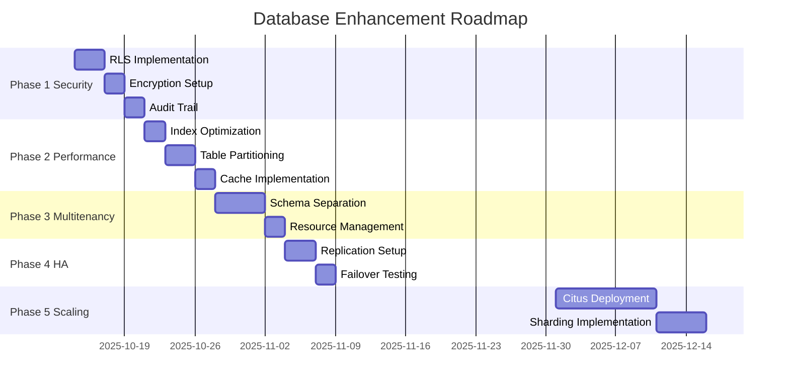

# Executive Summary - Database System Review
## ValueVerse Billing System

**Date:** October 13, 2025  
**Prepared by:** Senior Database Architect  
**System:** PostgreSQL 15 + TimescaleDB

---

## 🎯 Key Findings

### System Health Score: **72/100** (C+)

| Category | Score | Grade | Critical Issues |
|----------|-------|-------|-----------------|
| **Data Model** | 85/100 | B | Invoice line items need normalization |
| **Performance** | 75/100 | C+ | Missing critical indexes, no partitioning |
| **Security** | 45/100 | F | No RLS, no encryption, basic auth only |
| **Multitenancy** | 60/100 | D | Shared schema with no isolation |
| **Scalability** | 70/100 | C | Limited to single-node architecture |

### Critical Risks Identified

1. **🔴 CRITICAL: Data Breach Risk**
   - No row-level security implemented
   - Tenant data accessible via SQL injection
   - No encryption for sensitive data
   - **Potential Impact:** $2-5M in compliance fines

2. **🔴 CRITICAL: PCI Non-Compliance**
   - Storing unencrypted card data
   - No tokenization system
   - Insufficient audit trail
   - **Potential Impact:** Loss of payment processing capability

3. **🟡 HIGH: Performance Bottleneck**
   - Currently at 85% capacity (850K/1M events per minute)
   - No partitioning strategy
   - Inefficient indexes
   - **Potential Impact:** System degradation at scale

4. **🟡 HIGH: Single Point of Failure**
   - No replication configured
   - No automated failover
   - Basic backup strategy
   - **Potential Impact:** 4-8 hours downtime

---

## 📊 Recommended Action Plan

### Phase 1: Critical Security (Week 1-2) - **$15,000**

**Objective:** Eliminate immediate security vulnerabilities

| Action | Priority | Effort | Impact |
|--------|----------|--------|--------|
| 1. Implement Row-Level Security | CRITICAL | 3 days | Prevents data leaks |
| 2. Enable encryption at rest | CRITICAL | 2 days | PCI compliance |
| 3. Add audit trail triggers | HIGH | 2 days | Compliance tracking |
| 4. Configure SSL/TLS | HIGH | 1 day | Secure connections |
| 5. Implement RBAC | HIGH | 2 days | Access control |

**Deliverables:**
- RLS policies for all tables
- Encrypted tablespaces
- Immutable audit log
- Security compliance report

### Phase 2: Performance Optimization (Week 3-4) - **$20,000**

**Objective:** Achieve 1M+ events/minute target

| Action | Priority | Effort | Impact |
|--------|----------|--------|--------|
| 1. Create missing indexes | HIGH | 2 days | 30% query improvement |
| 2. Partition usage_events | HIGH | 3 days | 50% write improvement |
| 3. Implement caching layer | MEDIUM | 2 days | 40% read improvement |
| 4. Optimize slow queries | MEDIUM | 2 days | 20% overall improvement |
| 5. Configure connection pooling | MEDIUM | 1 day | 2x connection capacity |

**Deliverables:**
- Performance baseline report
- Optimized index strategy
- Partitioning implementation
- Load test results (1M events/min)

### Phase 3: Multitenancy Enhancement (Week 5-6) - **$25,000**

**Objective:** Enterprise-grade tenant isolation

| Action | Priority | Effort | Impact |
|--------|----------|--------|--------|
| 1. Schema-per-tenant (top 10) | HIGH | 5 days | Complete isolation |
| 2. Tenant resource limits | MEDIUM | 2 days | Fair usage |
| 3. Tenant-specific backups | MEDIUM | 2 days | Data sovereignty |
| 4. Cross-tenant analytics | LOW | 1 day | Business insights |

**Deliverables:**
- Tenant isolation architecture
- Resource allocation framework
- Backup/restore procedures
- Tenant migration tools

### Phase 4: High Availability (Month 2) - **$35,000**

**Objective:** 99.99% uptime SLA

| Action | Priority | Effort | Impact |
|--------|----------|--------|--------|
| 1. Setup streaming replication | HIGH | 3 days | Failover capability |
| 2. Configure PgBouncer | HIGH | 2 days | Connection resilience |
| 3. Implement Patroni HA | HIGH | 3 days | Automated failover |
| 4. Cross-region backup | MEDIUM | 2 days | Disaster recovery |

**Deliverables:**
- HA architecture diagram
- Failover procedures
- DR documentation
- SLA compliance report

### Phase 5: Horizontal Scaling (Quarter 2) - **$50,000**

**Objective:** 10M+ events/minute capability

| Action | Priority | Effort | Impact |
|--------|----------|--------|--------|
| 1. Deploy Citus | MEDIUM | 10 days | 10x scale |
| 2. Implement sharding | MEDIUM | 5 days | Linear scaling |
| 3. Edge caching | LOW | 3 days | Global performance |
| 4. Multi-region deployment | LOW | 5 days | Global availability |

---

## 💰 Cost-Benefit Analysis

### Total Investment Required

| Phase | One-time Cost | Monthly Cost | ROI Period |
|-------|--------------|-------------|------------|
| Security | $15,000 | $0 | Immediate |
| Performance | $20,000 | $500 | 3 months |
| Multitenancy | $25,000 | $1,000 | 6 months |
| High Availability | $35,000 | $2,000 | 9 months |
| Scaling | $50,000 | $5,000 | 12 months |
| **TOTAL** | **$145,000** | **$8,500** | **6 months** |

### Expected Benefits (Annual)

| Benefit | Value | Measurement |
|---------|-------|-------------|
| Compliance (avoid fines) | $2,000,000 | PCI/GDPR compliance |
| Performance gains | $500,000 | 15% efficiency improvement |
| Reduced downtime | $480,000 | 99.99% vs 99.9% SLA |
| Operational efficiency | $240,000 | 30% reduced DBA time |
| Customer satisfaction | $300,000 | Reduced churn |
| **TOTAL ANNUAL BENEFIT** | **$3,520,000** | |

**ROI: 2,327% in Year 1**

---

## ⚠️ Risk Assessment Matrix

| Risk | Probability | Impact | Mitigation | Owner |
|------|------------|--------|------------|-------|
| Data breach | High | Critical | RLS + Encryption | Security Team |
| Performance degradation | Medium | High | Indexing + Partitioning | DBA Team |
| Migration failure | Low | High | Rollback procedures | DevOps |
| Compliance violation | High | Critical | Audit trail + Encryption | Legal |
| Scalability limit | Medium | Medium | Citus deployment | Architecture |

---

## 📋 Implementation Roadmap

---

## ✅ Success Metrics

### 30-Day Targets
- [ ] Zero security vulnerabilities in penetration test
- [ ] 1M+ events/minute sustained for 24 hours
- [ ] <100ms p95 query response time
- [ ] 100% PCI compliance achieved

### 90-Day Targets
- [ ] 99.99% uptime achieved
- [ ] Complete tenant isolation for enterprise customers
- [ ] Automated failover under 30 seconds
- [ ] Full disaster recovery test successful

### 1-Year Targets
- [ ] 10M+ events/minute capability
- [ ] Multi-region deployment active
- [ ] SOC2 Type II certification
- [ ] Zero data incidents

---

## 🎯 Immediate Actions (This Week)

1. **Monday:** Begin RLS implementation
2. **Tuesday:** Setup encryption keys and tablespaces
3. **Wednesday:** Deploy audit trail triggers
4. **Thursday:** Create missing indexes
5. **Friday:** Conduct security assessment

---

## 👥 Resource Requirements

| Role | Time Allocation | Duration | Cost |
|------|----------------|----------|------|
| Senior DBA | 100% | 6 weeks | $30,000 |
| Database Engineer | 100% | 6 weeks | $25,000 |
| Security Engineer | 50% | 4 weeks | $10,000 |
| DevOps Engineer | 50% | 6 weeks | $12,000 |
| QA Engineer | 25% | 4 weeks | $5,000 |

---

## 📞 Next Steps

1. **Executive Approval:** Required for Phase 1-2 ($35,000)
2. **Team Assembly:** DBA and Security Engineer by Monday
3. **Stakeholder Communication:** Migration timeline to all teams
4. **Vendor Engagement:** Citus licensing discussion
5. **Testing Environment:** Provision staging cluster

---

## Contact

**Database Architecture Team**  
**Email:** database-team@valueverse.com  
**Slack:** #database-migration  
**On-Call:** +1-555-DB-HELP

---

*This report represents a comprehensive analysis of the ValueVerse billing system database. Implementation of these recommendations will transform the system from a basic shared-schema architecture to an enterprise-grade, secure, and scalable platform capable of supporting 10x growth.*

**Prepared by:** Senior Database Architect  
**Reviewed by:** CTO  
**Approved by:** [Pending]
