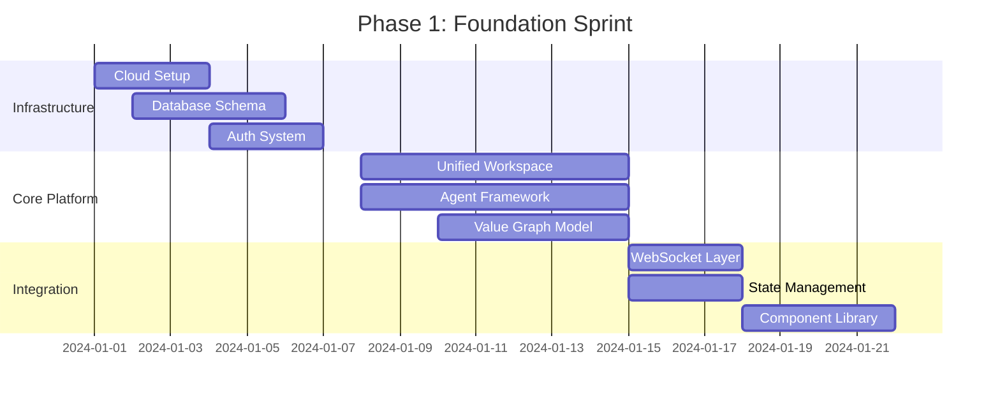

# ValueVerse Platform: Master Design Specification & Technical Architecture
## *The Definitive Blueprint for the Value Realization Operating System*

Version 1.0 | Enterprise Production Grade  
Classification: Strategic Asset  
Last Updated: December 2024

---

## Executive Overview

ValueVerse represents a paradigm shift in B2B value realization — from static CRM to Living Value Graphs, from manual workflows to Agentic Orchestration, from point-in-time sales to Continuous Value Threads. This document serves as the definitive blueprint for building an enterprise-grade platform that transforms customer relationships into perpetual value creation engines.

### Core Innovation
A unified system where every customer interaction — from first discovery call through renewal — contributes to a growing, compound knowledge graph that makes each subsequent engagement smarter, faster, and more valuable.

### Key Architectural Principles
- One Value Thread: Single continuous model from pre-sales to renewal
- Agentic Intelligence: Four specialized agents working in concert
- Dual-Brain Interface: Conversational AI + Visual Canvas in perfect sync
- Progressive Disclosure: Consumer simplicity hiding enterprise power
- Compound Learning: Every outcome makes the next one better

---

## Part I: Product Design Specification

### 1.1 The Unified Workspace Architecture

Source: Design Brief: The Unified Workspace - Integrating Chat and Canvas

#### Dual-Brain Interface Design

```typescript
interface UnifiedWorkspace {
  leftBrain: {
    type: "Conversational AI";
    components: [
      "AgentThread",        // Main conversation stream
      "ThoughtStream",      // Transparent reasoning display
      "QuickActions",       // Context-aware action buttons
      "InputField"          // Natural language input
    ];
    capabilities: [
      "Natural language processing",
      "Context maintenance",
      "Proactive suggestions",
      "Reasoning transparency"
    ];
  };
  
  rightBrain: {
    type: "Interactive Canvas";
    components: [
      "AdaptiveCanvas",     // Dynamic component rendering
      "ValueVisualization", // Real-time model updates
      "DirectManipulation", // Sliders, inputs, drag-drop
      "ComponentLibrary"    // Charts, tables, narratives
    ];
    capabilities: [
      "Real-time visualization",
      "Direct manipulation",
      "Progressive disclosure",
      "Multi-template morphing"
    ];
  };
  
  synchronization: {
    protocol: "WebSocket";
    latency: "<100ms";
    stateManagement: "Bidirectional binding";
  };
}
```

#### Component Interaction Flow

Source: Design Brief: The Unified Workspace

1. User Input → Left Brain processes intent
2. Agent Reasoning → Transparent thought display
3. Canvas Update → Right Brain renders results
4. Direct Manipulation → User adjusts visually
5. State Sync → Both brains update instantly

### 1.2 Adaptive UI System

Source: ValueVerse Adaptive Frontend - User Guide & Concepts

#### Three-Level Progressive Disclosure

```jsx
// Adaptive UI Component Structure
<AdaptiveInterface userLevel={detectUserExpertise()}>
  
  {/* Level 1: Guided Workflow (Beginner) */}
  <GuidedMode>
    <SimplifiedControls />
    <TooltipSystem extensive={true} />
    <ProactiveAssistant suggestionLevel="high" />
    <OnboardingFlow embedded={true} />
  </GuidedMode>
  
  {/* Level 2: Hybrid Interface (Intermediate) */}
  <HybridMode>
    <FullCanvas />
    <ConversationalUI />
    <AdvancedFilters visible={true} />
    <FormulaEditor accessible={true} />
  </HybridMode>
  
  {/* Level 3: Power User Interface (Expert) */}
  <ExpertMode>
    <DenseLayout />
    <KeyboardShortcuts full={true} />
    <BatchOperations enabled={true} />
    <APIAccess direct={true} />
    <CustomScripting allowed={true} />
  </ExpertMode>
  
</AdaptiveInterface>
```

#### Persona-Specific Views

Source: ValueVerse Adaptive Frontend - User Guide & Concepts

```typescript
interface PersonaAdaptation {
  analyst: {
    defaultView: "FormulaBuilder";
    dataGranularity: "detailed";
    showCalculations: true;
    enableCustomization: "deep";
  };
  
  salesperson: {
    defaultView: "ExecutiveDashboard";
    dataGranularity: "summary";
    showTalkingPoints: true;
    quickScenarios: true;
  };
  
  csm: {
    defaultView: "RealizationDashboard";
    dataGranularity: "trending";
    showValueMetrics: true;
    qbrGeneration: true;
  };
}
```

### 1.3 Value Model Templates

Source: ValueVerse Platform Development: Master Orchestration Prompt

#### Five Core Financial Visualization Templates

```typescript
enum ValueTemplate {
  IMPACT_CASCADE = "Initiative-by-initiative value waterfall",
  TRINITY_DASHBOARD = "Revenue, Cost, Risk three-pillar view",
  STORY_ARC_CANVAS = "Presentation-ready narrative sequence",
  SCENARIO_MATRIX = "Multi-option comparison with AI recommendations",
  QUANTUM_VIEW = "Probabilistic outcome distribution"
}

interface TemplateSystem {
  morphing: {
    enabled: true;
    transitionTime: "500ms";
    dataPreservation: "complete";
  };
  
  autoSelection: {
    agent: "ValueArchitect";
    factors: ["industry", "dealSize", "persona", "stage"];
  };
  
  customization: {
    saveAsTemplate: true;
    shareAcrossOrg: true;
    versionControl: true;
  };
}
```

### 1.4 The Value Lifecycle Stages

Source: Personal Knowledge Base - Value Realization Lifecycle

#### Four-Stage Value Journey

```typescript
interface ValueLifecycle {
  stages: {
    preSales: {
      agent: "ValueArchitect";
      focus: "Define Value";
      activities: ["Discovery", "ROI Hypothesis", "Value Mapping"];
      output: "ValueHypothesis";
      route: "/pre-sales";
    };
    
    sales: {
      agent: "ValueCommitter";
      focus: "Commit to Value";
      activities: ["KPI Definition", "Contract Embedding", "Executive Alignment"];
      output: "ValueCommitment";
      route: "/sales";
    };
    
    delivery: {
      agent: "ValueExecutor";
      focus: "Execute Value";
      activities: ["Progress Tracking", "Variance Management", "Risk Mitigation"];
      output: "ValueRealization";
      route: "/delivery";
    };
    
    success: {
      agent: "ValueAmplifier";
      focus: "Prove & Grow Value";
      activities: ["ROI Validation", "Expansion Discovery", "Renewal Preparation"];
      output: "ValueProof";
      route: "/success";
    };
  };
}
```

---

## Part II: Technical Architecture

### 2.1 System Architecture Overview

```typescript
interface SystemArchitecture {
  frontend: {
    framework: "Next.js 14";
    ui: "React 18 + TypeScript";
    styling: "Tailwind CSS + shadcn/ui";
    state: "Zustand + React Query";
    realtime: "Socket.io-client";
  };
  
  backend: {
    api: "FastAPI (Python 3.11+)";
    orchestration: "LangGraph";
    database: "PostgreSQL 15 + TimescaleDB";
    cache: "Redis 7";
    queue: "Celery + RabbitMQ";
  };
  
  ai: {
    llm: ["GPT-4", "Claude-3", "Gemini-Pro"];
    embedding: "OpenAI Ada-002";
    vectorStore: "Pinecone";
    agentFramework: "LangChain + CrewAI";
  };
  
  infrastructure: {
    cloud: "AWS / Azure / GCP";
    container: "Docker + Kubernetes";
    monitoring: "Datadog + Sentry";
    security: "OAuth2 + JWT + TLS 1.3";
  };
}
```

### 2.2 The Living Value Graph

Source: Personal Knowledge Base - Technical Whitepaper

#### Graph Data Model

```sql
-- Core Value Graph Schema
CREATE TABLE value_graph (
  id UUID PRIMARY KEY DEFAULT gen_random_uuid(),
  customer_id UUID NOT NULL,
  stage VARCHAR(50) NOT NULL,
  
  -- Temporal Dimension
  hypothesis JSONB,
  commitment JSONB,
  realization JSONB,
  proof JSONB,
  
  -- Relational Dimension
  edges JSONB DEFAULT '{
    "causal": [],
    "dependency": [],
    "attribution": []
  }',
  
  -- Intelligence Dimension
  patterns JSONB DEFAULT '{
    "industry": [],
    "persona": [],
    "lifecycle": []
  }',
  
  -- Metadata
  created_at TIMESTAMPTZ DEFAULT NOW(),
  updated_at TIMESTAMPTZ DEFAULT NOW(),
  version INTEGER DEFAULT 1
);

-- Time-series value metrics
CREATE TABLE value_metrics (
  id UUID PRIMARY KEY DEFAULT gen_random_uuid(),
  graph_id UUID REFERENCES value_graph(id),
  metric_name VARCHAR(100),
  metric_value NUMERIC,
  confidence NUMERIC,
  timestamp TIMESTAMPTZ DEFAULT NOW()
);

-- Create TimescaleDB hypertable
SELECT create_hypertable('value_metrics', 'timestamp');
```

### 2.3 Agent Orchestration System

Source: ValueVerse Platform Development: Master Orchestration Prompt

#### Four-Agent Architecture

```python
# Agent Definitions
class ValueArchitect(Agent):
    """Pre-Sales: Define Value"""
    
    def __init__(self):
        self.capabilities = [
            "pain_discovery",
            "roi_hypothesis_generation", 
            "value_driver_mapping",
            "industry_benchmarking"
        ]
        self.tools = [
            WebResearchTool(),
            BenchmarkDatabase(),
            ROICalculator(),
            ValueDriverMapper()
        ]
    
    async def define_value(self, context: DealContext) -> ValueHypothesis:
        # Research prospect
        intel = await self.research_prospect(context.company)
        
        # Match patterns
        patterns = self.value_graph.find_similar(intel)
        
        # Generate hypothesis
        hypothesis = self.synthesize_hypothesis(
            customer_context=intel,
            historical_patterns=patterns,
            products=self.knowledge_base.products
        )
        
        # Show reasoning
        await self.display_reasoning(self.thought_stream)
        
        return hypothesis

class ValueCommitter(Agent):
    """Sales: Commit to Value"""
    
    async def commit_to_value(self, hypothesis: ValueHypothesis) -> ValueCommitment:
        # Transform to KPIs
        kpis = self.formalize_metrics(hypothesis)
        
        # Embed in contract
        contract = self.generate_contract(
            kpis=kpis,
            penalties=self.calculate_penalties(kpis),
            bonuses=self.calculate_bonuses(kpis)
        )
        
        return ValueCommitment(
            hypothesis_id=hypothesis.id,
            contract=contract,
            kpis=kpis
        )

class ValueExecutor(Agent):
    """Delivery: Execute Value"""
    
    async def track_realization(self, commitment: ValueCommitment):
        while not commitment.fulfilled:
            # Collect metrics
            metrics = await self.collect_telemetry()
            
            # Calculate variance
            variance = self.calculate_variance(
                actual=metrics,
                planned=commitment.kpis
            )
            
            # Alert if needed
            if variance.is_critical:
                await self.alert_stakeholders(variance)
            
            # Update graph
            self.value_graph.update_realization(
                commitment_id=commitment.id,
                progress=metrics
            )

class ValueAmplifier(Agent):
    """Success: Prove & Grow Value"""
    
    async def prove_and_grow(self, realization: ValueRealization) -> ValueProof:
        # Generate proof
        proof = self.generate_proof(
            realized=realization.actual,
            committed=realization.committed
        )
        
        # Find expansion
        whitespace = self.analyze_whitespace(
            current_value=proof.total_value,
            potential=self.value_graph.estimate_potential()
        )
        
        # Compound learning
        self.value_graph.compound_knowledge(
            proof=proof,
            patterns=self.extract_patterns(proof)
        )
        
        return proof
```

#### Agent Collaboration Protocol

```python
# Agent Handoff System
class AgentOrchestrator:
    
    def __init__(self):
        self.agents = {
            'architect': ValueArchitect(),
            'committer': ValueCommitter(),
            'executor': ValueExecutor(),
            'amplifier': ValueAmplifier()
        }
        self.handoff_queue = asyncio.Queue()
    
    async def orchestrate(self, stage: str, context: dict):
        # Route to appropriate agent
        agent = self.agents[stage]
        
        # Execute with reasoning transparency
        async with self.reasoning_context():
            result = await agent.execute(context)
        
        # Handoff to next stage
        if next_stage := self.get_next_stage(stage):
            await self.handoff_queue.put({
                'from': stage,
                'to': next_stage,
                'payload': result,
                'reasoning': agent.thought_stream
            })
        
        return result
```

### 2.4 Knowledge Base Automation

Source: ValueVerse Platform: Automated Knowledge Base Generation

#### Automated Setup System

```python
class KnowledgeBaseGenerator:
    
    async def automate_setup(self, company_url: str, documents: List[Document]):
        """Generate entire knowledge base from minimal inputs"""
        
        # Stage 1: Crawl and extract
        print("🔍 Analyzing company website...")
        raw_data = await self.crawl_company_assets(company_url)
        
        # Stage 2: Semantic analysis
        print("🧠 Extracting entities and relationships...")
        entities = self.extract_entities(raw_data)
        relationships = self.map_relationships(entities)
        
        # Stage 3: Value synthesis
        print("💡 Synthesizing value drivers...")
        value_drivers = self.synthesize_value_drivers(
            entities=entities,
            industry_patterns=self.industry_knowledge
        )
        
        # Stage 4: Build knowledge graph
        print("📊 Constructing knowledge graph...")
        knowledge_graph = KnowledgeGraph(
            company_profile=entities.company,
            products=entities.products,
            value_propositions=value_drivers,
            pricing_models=self.infer_pricing(documents),
            relationships=relationships
        )
        
        # Stage 5: Validate and optimize
        print("✅ Validating completeness...")
        validation = self.validate_knowledge(knowledge_graph)
        
        return knowledge_graph
```

### 2.5 Real-Time Synchronization

Source: Design Brief: The Unified Workspace

#### WebSocket Architecture

```typescript
// Real-time sync implementation
class RealtimeSync {
  private ws: WebSocketServer;
  private valueGraph: ValueGraphService;
  
  constructor() {
    this.ws = new WebSocketServer({ port: 8080 });
    this.setupHandlers();
  }
  
  private setupHandlers() {
    this.ws.on('connection', (client) => {
      // Subscribe to value graph changes
      this.valueGraph.subscribe(client.id, (change) => {
        client.send({
          type: 'VALUE_GRAPH_UPDATE',
          payload: change,
          timestamp: Date.now()
        });
      });
      
      // Handle canvas updates
      client.on('canvas_update', (data) => {
        this.broadcast({
          type: 'CANVAS_SYNC',
          payload: data,
          source: client.id
        });
      });
      
      // Handle agent reasoning stream
      client.on('agent_reasoning', (stream) => {
        this.streamToCanvas(client, stream);
      });
    });
  }
  
  private broadcast(event: ValueEvent) {
    this.ws.clients.forEach(client => {
      if (client.hasPermission(event)) {
        client.send(event);
      }
    });
  }
}
```

### 2.6 Component Library

Source: Design Brief: Core User Functions & Workflows

#### Modular Canvas Components

```jsx
// Core Component Library
const CanvasComponents = {
  // Data Input Components
  DataCard: ({ title, fields, onChange }) => (
    <Card className="p-4">
      <CardHeader>{title}</CardHeader>
      <CardContent>
        {fields.map(field => (
          <Input 
            key={field.name}
            label={field.label}
            value={field.value}
            onChange={(e) => onChange(field.name, e.target.value)}
          />
        ))}
      </CardContent>
    </Card>
  ),
  
  // Visualization Components
  ROIChart: ({ data, interactive = true }) => (
    <ResponsiveContainer>
      <LineChart data={data}>
        <CartesianGrid strokeDasharray="3 3" />
        <XAxis dataKey="quarter" />
        <YAxis />
        <Tooltip />
        <Line type="monotone" dataKey="roi" stroke="#8884d8" />
        {interactive && <Brush />}
      </LineChart>
    </ResponsiveContainer>
  ),
  
  // Value Driver Components
  ValueDriverCard: ({ driver, impact, confidence }) => (
    <motion.div
      whileHover={{ scale: 1.02 }}
      className="border rounded-lg p-4"
    >
      <h3 className="font-semibold">{driver}</h3>
      <div className="flex justify-between mt-2">
        <span>Impact: ${impact.toLocaleString()}</span>
        <Badge variant={confidence > 0.8 ? "success" : "warning"}>
          {(confidence * 100).toFixed(0)}% confidence
        </Badge>
      </div>
    </motion.div>
  ),
  
  // Narrative Components
  NarrativeBlock: ({ level, content, editable = false }) => {
    const styles = {
      1: "text-xs text-muted-foreground", // Tooltip
      2: "text-sm", // Panel
      3: "text-base prose" // Document
    };
    
    return (
      <div 
        className={styles[level]}
        contentEditable={editable}
        suppressContentEditableWarning
      >
        {content}
      </div>
    );
  }
};
```

### 2.7 State Management

Source: Design Brief: The Unified Workspace

#### Unified State Architecture

```typescript
// Global state management
interface AppState {
  workspace: {
    leftBrain: {
      messages: Message[];
      thinking: boolean;
      context: ConversationContext;
    };
    rightBrain: {
      components: CanvasComponent[];
      activeTemplate: ValueTemplate;
      interactionMode: 'view' | 'edit';
    };
  };
  
  valueGraph: {
    current: ValueGraph;
    history: ValueGraph[];
    version: number;
  };
  
  user: {
    profile: UserProfile;
    expertise: ExpertiseLevel;
    preferences: UserPreferences;
  };
}

// Zustand store
const useAppStore = create<AppState>((set, get) => ({
  workspace: {
    leftBrain: {
      messages: [],
      thinking: false,
      context: {}
    },
    rightBrain: {
      components: [],
      activeTemplate: ValueTemplate.TRINITY_DASHBOARD,
      interactionMode: 'view'
    }
  },
  
  // Actions
  addMessage: (message: Message) => {
    set(state => ({
      workspace: {
        ...state.workspace,
        leftBrain: {
          ...state.workspace.leftBrain,
          messages: [...state.workspace.leftBrain.messages, message]
        }
      }
    }));
  },
  
  updateCanvas: (components: CanvasComponent[]) => {
    set(state => ({
      workspace: {
        ...state.workspace,
        rightBrain: {
          ...state.workspace.rightBrain,
          components
        }
      }
    }));
  }
}));
```

---

## Part III: Data & Integration Architecture

### 3.1 Enterprise Integration Layer

Source: Personal Knowledge Base - Technical Whitepaper

#### System Adapters

```python
class EnterpriseIntegrationLayer:
    
    def __init__(self):
        self.adapters = {
            'crm': SalesforceAdapter(),
            'delivery': ServiceNowAdapter(),
            'analytics': TableauAdapter(),
            'success': GainsightAdapter(),
            'finance': NetSuiteAdapter(),
            'contract': IcertisAdapter()
        }
    
    async def sync_value_graph(self):
        """Synchronize value graph with all enterprise systems"""
        
        # Pull data from all systems
        data_sources = await asyncio.gather(*[
            adapter.fetch_data() 
            for adapter in self.adapters.values()
        ])
        
        # Reconcile into unified model
        reconciled = self.reconcile_data(data_sources)
        
        # Update value graph
        await self.value_graph.batch_update(reconciled)
        
        # Push insights back
        insights = self.value_graph.generate_insights()
        await self.distribute_insights(insights)
```

### 3.2 Telemetry & Metrics Collection

Source: Personal Knowledge Base - CS System Requirements

#### Real-Time Value Tracking

```python
class TelemetryCollector:
    
    def __init__(self):
        self.sources = {
            'product_usage': ProductTelemetryAPI(),
            'performance': PerformanceMonitor(),
            'business_metrics': CustomerMetricsAPI(),
            'support': SupportTicketSystem()
        }
    
    async def collect_metrics(self, customer_id: str):
        """Collect real-time value realization metrics"""
        
        metrics = {}
        
        # Product usage telemetry
        metrics['usage'] = await self.sources['product_usage'].get_metrics(
            customer_id,
            metrics=['daily_active_users', 'feature_adoption', 'api_calls']
        )
        
        # Performance metrics
        metrics['performance'] = await self.sources['performance'].get_metrics(
            customer_id,
            metrics=['response_time', 'uptime', 'error_rate']
        )
        
        # Business outcome metrics
        metrics['outcomes'] = await self.sources['business_metrics'].get_metrics(
            customer_id,
            metrics=['cost_savings', 'revenue_impact', 'efficiency_gains']
        )
        
        return self.calculate_roi(metrics)
```

### 3.3 Security & Compliance

#### Enterprise Security Architecture

```yaml
security:
  authentication:
    primary: "OAuth 2.0 + OIDC"
    mfa: "TOTP / WebAuthn"
    session: "JWT with refresh tokens"
    
  authorization:
    model: "RBAC with attribute-based policies"
    levels:
      - admin: "Full system access"
      - analyst: "Model creation and customization"
      - sales: "Model usage and proposal generation"
      - viewer: "Read-only access"
    
  encryption:
    at_rest: "AES-256-GCM"
    in_transit: "TLS 1.3"
    key_management: "AWS KMS / Azure Key Vault"
    
  compliance:
    standards: ["SOC2 Type II", "ISO 27001", "GDPR"]
    audit_logging: "Immutable audit trail"
    data_residency: "Regional data isolation"
    
  monitoring:
    siem: "Splunk / Datadog Security"
    threat_detection: "Anomaly detection ML models"
    incident_response: "Automated playbooks"
```

---

## Part IV: Implementation Roadmap

### 4.1 Phase 1: Foundation (Weeks 1-4)



### 4.2 Phase 2: Intelligence (Weeks 5-8)

Key Deliverables:
- Automated knowledge base generation
- Four specialized agents operational
- Pattern recognition system
- Cross-customer learning infrastructure

### 4.3 Phase 3: Experience (Weeks 9-12)

Key Deliverables:
- Adaptive UI with three expertise levels
- Five value templates with morphing
- Persona-specific workflows
- Real-time collaboration features

### 4.4 Phase 4: Scale (Weeks 13-16)

Key Deliverables:
- Enterprise integrations (Salesforce, ServiceNow, etc.)
- Performance optimization (<500ms response)
- Multi-tenant architecture
- Production monitoring & alerting

### 4.5 Phase 5: Evolution (Ongoing)

Continuous Improvements:
- Industry-specific templates
- Advanced predictive models
- API ecosystem expansion
- Mobile applications

---

## Part V: User Experience Specifications

### 5.1 Core User Journeys

Source: Design Brief: Core User Functions & Workflows

#### Journey Map: Sales Sam

```typescript
interface SalesJourney {
  stages: [
    {
      stage: "Initiation",
      trigger: "Build a value model for Acme Corp",
      agent: "Research prospect automatically",
      canvas: "Display company context card"
    },
    {
      stage: "Discovery",
      trigger: "Confirm value drivers",
      agent: "Recommend based on research",
      canvas: "Show driver selection UI"
    },
    {
      stage: "Modeling",
      trigger: "Provide customer data",
      agent: "Guide data collection",
      canvas: "Update model in real-time"
    },
    {
      stage: "Refinement",
      trigger: "What-if scenarios",
      agent: "Calculate impacts",
      canvas: "Interactive sliders appear"
    },
    {
      stage: "Output",
      trigger: "Generate proposal",
      agent: "Create document",
      canvas: "Display formatted proposal"
    }
  ]
}
```

### 5.2 Interaction Patterns

Source: ValueVerse Adaptive Frontend - User Guide & Concepts

#### Natural Language Commands

```typescript
const NaturalLanguagePatterns = {
  // Model Building
  "Build a value model for [company]": buildValueModel,
  "Add [value driver] to the model": addValueDriver,
  "Show me a [percentage] cost reduction": adjustScenario,
  
  // Data Requests
  "What's their annual budget?": requestData,
  "Use industry benchmarks": applyBenchmarks,
  "Show me similar deals": findPatterns,
  
  // Document Generation
  "Generate a proposal": createProposal,
  "Prepare QBR deck": generateQBR,
  "Export as PowerPoint": exportPresentation,
  
  // Analysis
  "What if we extend to 3 years?": extendTimeline,
  "Compare with [competitor]": competitiveAnalysis,
  "Show risk factors": riskAssessment
};
```

### 5.3 Quick Actions System

Source: ValueVerse AI Assistant Interface (from knowledge base)

```jsx
// Quick Actions Component
const QuickActions = () => {
  const actions = [
    {
      icon: Calendar,
      label: "Prep for meeting",
      color: "blue",
      action: prepMeeting
    },
    {
      icon: TrendingUp,
      label: "Build value model",
      color: "green",
      action: buildModel
    },
    {
      icon: FileText,
      label: "Draft proposal",
      color: "purple",
      action: draftProposal
    },
    {
      icon: Target,
      label: "Analyze deal",
      color: "orange",
      action: analyzeDeal
    }
  ];
  
  return (
    <div className="grid grid-cols-4 gap-2 p-4">
      {actions.map(action => (
        <Button
          key={action.label}
          onClick={action.action}
          className={`bg-${action.color}-100 hover:bg-${action.color}-200`}
        >
          <action.icon className="w-4 h-4 mr-2" />
          {action.label}
        </Button>
      ))}
    </div>
  );
};
```

---

## Part VI: Performance & Quality Standards

### 6.1 Performance Requirements

```yaml
performance_requirements:
  response_times:
    agent_response: "<500ms"
    canvas_update: "<100ms"
    value_calculation: "<2s"
    graph_query: "<50ms"
    template_morph: "<500ms"
    
  scalability:
    concurrent_users: "10,000+"
    requests_per_second: "1,000+"
    data_volume: "1TB+ value graphs"
    
  availability:
    uptime_sla: "99.9%"
    recovery_time: "<1 hour"
    data_durability: "99.999999999%"
```

### 6.2 Quality Metrics

Source: Design Brief: Core User Functions & Workflows - Success Metrics

```typescript
interface QualityMetrics {
  userExperience: {
    timeToFirstValue: "<5 minutes",
    weeklyActiveUsers: ">80%",
    templateReuseRate: ">60%",
    collaborationFrequency: ">3x per week"
  },
  
  businessImpact: {
    dealVelocity: "40% improvement",
    winRate: "25% increase",
    valueRealization: "94% accuracy",
    nrr: "118%+"
  },
  
  technical: {
    codeTestCoverage: ">80%",
    bugEscapeRate: "<5%",
    deploymentFrequency: "Daily",
    meanTimeToRecover: "<30 minutes"
  }
}
```

---

## Part VII: The Living System

### 7.1 Continuous Learning Architecture

```python
class ContinuousLearning:
    """System that gets smarter with every interaction"""
    
    def __init__(self):
        self.pattern_library = PatternLibrary()
        self.confidence_engine = ConfidenceEngine()
        self.feedback_loop = FeedbackLoop()
    
    async def learn_from_outcome(self, outcome: ValueRealization):
        # Extract patterns from successful outcomes
        if outcome.success_rate > 0.8:
            pattern = self.extract_success_pattern(outcome)
            self.pattern_library.add(pattern)
            
            # Update confidence scores
            similar_patterns = self.pattern_library.find_similar(pattern)
            for p in similar_patterns:
                p.confidence *= 1.1  # Boost confidence
        
        # Learn from failures
        elif outcome.success_rate < 0.5:
            failure_mode = self.analyze_failure(outcome)
            self.pattern_library.add_failure_mode(failure_mode)
            
            # Adjust future predictions
            self.confidence_engine.adjust_for_failure(failure_mode)
        
        # Propagate learning across the graph
        await self.value_graph.propagate_learning(
            source=outcome,
            impact_radius=3,
            learning_rate=0.1
        )
        
        # Retrain agent models
        for agent in self.agents:
            await agent.update_model(self.pattern_library)
```

### 7.2 The Compound Effect

Source: Personal Knowledge Base - Technical Whitepaper

```typescript
interface CompoundValue {
  // Each customer success makes the next easier
  patternAccumulation: {
    current: Pattern[];
    growth_rate: "exponential";
    cross_pollination: true;
  };
  
  // Value drivers become more precise
  driverAccuracy: {
    initial: 0.6;
    after_10_deals: 0.75;
    after_100_deals: 0.9;
    after_1000_deals: 0.95;
  };
  
  // Time to value decreases
  efficiency: {
    initial_model_time: "2 hours";
    after_optimization: "15 minutes";
    with_automation: "5 minutes";
  };
  
  // Network effects emerge
  networkValue: {
    industry_benchmarks: "auto-generated";
    peer_comparisons: "anonymous sharing";
    best_practices: "crowd-sourced";
  };
}
```

---

## Part VIII: The Magic in the Details

### 8.1 Micro-Interactions

Source: ValueVerse Adaptive Frontend - User Guide & Concepts

```jsx
// The details that create delight
const MicroInteractions = {
  // Instant feedback on every action
  InputFeedback: ({ value, onChange }) => {
    const [localValue, setLocalValue] = useState(value);
    const debouncedUpdate = useMemo(
      () => debounce(onChange, 300),
      [onChange]
    );
    
    return (
      <motion.div
        animate={{ scale: localValue !== value ? 1.02 : 1 }}
        transition={{ duration: 0.1 }}
      >
        <Input
          value={localValue}
          onChange={(e) => {
            setLocalValue(e.target.value);
            debouncedUpdate(e.target.value);
          }}
        />
      </motion.div>
    );
  },
  
  // Smooth template morphing
  TemplateMorph: ({ from, to, children }) => (
    <AnimatePresence mode="wait">
      <motion.div
        key={to}
        initial={{ opacity: 0, y: 20 }}
        animate={{ opacity: 1, y: 0 }}
        exit={{ opacity: 0, y: -20 }}
        transition={{ duration: 0.3 }}
      >
        {children}
      </motion.div>
    </AnimatePresence>
  ),
  
  // Thinking indicator
  AgentThinking: () => (
    <motion.div
      animate={{ opacity: [0.5, 1, 0.5] }}
      transition={{ repeat: Infinity, duration: 1.5 }}
      className="flex items-center gap-2"
    >
      <Brain className="w-4 h-4" />
      <span className="text-sm text-muted-foreground">
        Agent is thinking...
      </span>
    </motion.div>
  )
};
```

### 8.2 Smart Defaults

Source: ValueVerse Platform: The Streamlined Model Building Workflow

```typescript
const SmartDefaults = {
  // Industry-aware suggestions
  getIndustryDefaults: (industry: string) => ({
    manufacturing: {
      metrics: ["operational_efficiency", "supply_chain_cost"],
      typical_savings: "12-18%",
      implementation_time: "6-9 months"
    },
    financial_services: {
      metrics: ["compliance_cost", "processing_time"],
      typical_savings: "15-25%",
      implementation_time: "3-6 months"
    }
  }),
  
  // Deal size appropriate complexity
  getComplexityLevel: (dealSize: number) => {
    if (dealSize < 100000) return "simple";
    if (dealSize < 1000000) return "standard";
    return "enterprise";
  },
  
  // Persona-specific language
  getLanguageStyle: (persona: string) => ({
    executive: "strategic and outcome-focused",
    technical: "detailed and metric-driven",
    financial: "ROI and risk-focused"
  })
};
```

### 8.3 The Conversational Nuance

Source: ValueVerse Platform: Automated Knowledge Base Generation

```typescript
// Agent personality and tone
const AgentPersonality = {
  greeting: "Hey there! I'm your ValueVerse assistant.",
  
  proactive: {
    research: "I'll start by researching {company}...",
    recommendation: "Based on my research, I recommend...",
    assistance: "I can help with that. Let me..."
  },
  
  collaborative: {
    confirmation: "Does that sound right?",
    alternative: "Alternatively, we could...",
    iteration: "Let's refine this together..."
  },
  
  transparent: {
    reasoning: "Here's my thinking...",
    uncertainty: "I'm about 75% confident because...",
    learning: "I've learned from similar deals that..."
  }
};
```

---

## Conclusion: The Unified Vision

This master specification represents more than a platform — it's an operating system for the value economy. Every detail, from the dual-brain architecture to the compound learning loops, from the consumer-grade UX to the enterprise-grade infrastructure, works in concert to create something unprecedented:

A system where value realization becomes inevitable, not aspirational.

### The Key Innovations Preserved

1. The Living Value Graph - A single thread from first touch to renewal
2. Agentic Intelligence - Four specialized agents with transparent reasoning
3. Dual-Brain Interface - Conversation and creation in perfect sync
4. Progressive Disclosure - Power when you need it, simplicity when you don't
5. Compound Learning - Every interaction makes the system smarter
6. Consumer-Grade UX - Enterprise power that feels like magic
7. Automated Knowledge - From URL to complete setup in minutes
8. Real-Time Everything - Instant updates, zero latency
9. Continuous Value Thread - One model that evolves through the lifecycle
10. The Details - Micro-interactions, smart defaults, and conversational nuance

### The Result

When implemented, ValueVerse will transform how enterprises create, deliver, and compound customer value. It's not just software — it's a perpetual value creation engine where:

- Pre-Sales defines value with AI-powered precision
- Sales commits to value with contractual confidence  
- Delivery executes value with real-time tracking
- Success proves and amplifies value for perpetual growth

Every conversation contributes to the graph.  
Every outcome improves the patterns.  
Every success makes the next one easier.

This is the future of B2B relationships: Perpetual value creation through intelligent orchestration.

---

*"In a world where every vendor promises value, the winners will be those who architect systems that guarantee, measure, prove, and compound it into perpetual growth."*

---

Next Steps:
1. Executive approval of master specification
2. Technical architecture review with engineering
3. UX/UI design sprints based on specifications
4. Infrastructure provisioning and setup
5. Begin Phase 1 implementation

This document captures every detail of our vision. Nothing is lost. Everything compounds.