# The Value Realization Lifecycle: An Enterprise Masterpiece

## Executive Summary

Transform your customer journey into a continuous value creation engine where every team — from pre-sales to customer success — orchestrates around a single, living business case that evolves from hypothesis to proven ROI.

---

## The Vision: One Value Thread, Four Synchronized Stages

```mermaid
graph LR
    A[🎯 Define Value] --> B[🤝 Commit to Value]
    B --> C[⚡ Execute Value]
    C --> D[📈 Prove & Grow Value]
    D -.->|Continuous Learning| A
    
    style A fill:#3B82F6,color:#fff
    style B fill:#10B981,color:#fff
    style C fill:#F59E0B,color:#fff
    style D fill:#8B5CF6,color:#fff
```



---

## The Four-Act Value Symphony

### Act I: Pre-Sales — The Value Architect 🎯
Mission: Transform discovery into quantified opportunity

| Activity | Orchestration | Output |
|-------------|------------------|------------|
| Pain Discovery | AI-powered insight mining from calls, emails, industry data | Pain-to-Value Map |
| ROI Modeling | Dynamic hypothesis generation with adjustable assumptions | Initial Business Case |
| Stakeholder Mapping | Executive sponsor alignment scoring | Decision Framework |

🎭 Value Theater: *"We've identified $2.3M in operational inefficiencies across your supply chain — here's how we unlock it together."*

---

### Act II: Sales — The Value Committer 🤝
Mission: Convert promise into contractual accountability

| Activity | Orchestration | Output |
|-------------|------------------|------------|
| Success Metrics Definition | Embed KPIs directly into SOW/contracts | Outcome-Based Agreement |
| Risk Mitigation | Joint accountability matrix with penalty/bonus clauses | Shared Success Plan |
| Executive Alignment | C-level commitment ceremonies with recorded pledges | Governance Charter |

🎭 Value Theater: *"Our contract guarantees 15% cost reduction by Q3, with quarterly milestone reviews and success bonuses tied to overachievement."*

---

### Act III: Delivery — The Value Executor ⚡
Mission: Transform commitments into measurable reality

| Activity | Orchestration | Output |
|-------------|------------------|------------|
| Real-time Tracking | IoT/API telemetry feeding live ROI dashboards | Value Pulse Dashboard |
| Variance Management | AI alerts when KPIs drift >10% from target | Course Correction Plans |
| Quarterly Ceremonies | Executive Business Reviews with proven outcomes | Value Realization Reports |

🎭 Value Theater: *"Week 12 Update: We've achieved $780K in savings (34% of target), with automation reducing processing time by 47%."*

---

### Act IV: Customer Success — The Value Amplifier 📈
Mission: Compound proven value into perpetual growth

| Activity | Orchestration | Output |
|-------------|------------------|------------|
| Impact Validation | Before/after analysis with attributed business outcomes | ROI Proof Points |
| Expansion Discovery | AI-identified whitespace based on achieved results | Growth Roadmap |
| Renewal Orchestration | Value-justified renewals with pre-loaded success metrics | Next-Phase Business Case |

🎭 Value Theater: *"You've realized $2.7M in value (117% of target). Based on this success, expanding to EMEA would yield an additional $4.1M."*

---

## The Intelligent Orchestration Layer

### 🧠 The Value Graph: Your Living Business Case

```typescript
interface ValueGraph {
  hypothesis: {
    painPoints: Pain[];
    valueDrivers: Driver[];
    roiProjection: number;
    assumptions: Assumption[];
  };
  
  commitment: {
    contractedKPIs: KPI[];
    successCriteria: Criteria[];
    accountabilityMatrix: Owner[];
    outcomeDeadlines: Milestone[];
  };
  
  realization: {
    actualROI: number;
    kpiProgress: Progress[];
    valueLeakage: Risk[];
    optimizationOpps: Opportunity[];
  };
  
  amplification: {
    provenOutcomes: Achievement[];
    expansionPaths: Growth[];
    advocacyScore: number;
    renewalJustification: BusinessCase;
  };
}
```

### 🤖 Four Specialized Agents Working as One

| Agent | Capabilities | Memory | Handoff |
|-----------|-----------------|------------|-------------|
| Value Architect | • Industry benchmarking<br>• Pain quantification<br>• Hypothesis generation | Customer context, discovery transcripts | → Hypothesis Object |
| Value Committer | • Contract intelligence<br>• Risk assessment<br>• Stakeholder alignment | Negotiation history, pricing models | → Commitment Object |
| Value Executor | • Telemetry analysis<br>• Variance detection<br>• Report synthesis | Project data, KPI trends | → Realization Object |
| Value Amplifier | • Outcome attribution<br>• Expansion modeling<br>• Advocacy scoring | Success history, benchmark library | → Proof Object → Loop |

---

## The Experience Architecture

### 🎨 Adaptive Interfaces by Persona

```jsx
// Executive View: Strategic KPIs & Decisions
<ExecutiveDashboard>
  <ValueSummaryCard roi="$2.3M" confidence="87%" />
  <DecisionPoints upcoming={3} critical={1} />
  <StrategicAlerts risks={2} opportunities={5} />
</ExecutiveDashboard>

// Operator View: Tactical Execution & Tracking
<DeliveryCommand>
  <TaskBoard activeWork={23} blockers={2} />
  <MetricTrackers live={true} variance={-3.2} />
  <ResourceOptimizer efficiency="92%" />
</DeliveryCommand>

// Success View: Relationship & Growth
<CustomerPortal>
  <ImpactStory achievements={12} testimonials={3} />
  <HealthScore current={94} trend="improving" />
  <ExpansionCanvas whitespace="$4.1M" />
</CustomerPortal>
```

---

## The Technology Foundation

### 🔧 Enterprise Integration Stack

| Layer | Technologies | Purpose |
|-----------|-----------------|-------------|
| Data Substrate | Snowflake, BigQuery, Databricks | Unified value metrics warehouse |
| Intelligence | GPT-4, Claude, Vertex AI | Agent reasoning & synthesis |
| Orchestration | Temporal, Airflow, n8n | Cross-system workflow automation |
| Experience | Next.js 14, React 18, Framer | Adaptive multi-persona UX |
| Integration | Salesforce, ServiceNow, Gainsight | Ecosystem connectivity |

---

## The Transformation Impact

### 📊 Measurable Outcomes

| Metric | Before | After | Impact |
|------------|-----------|-----------|------------|
| Deal Velocity | 127 days | 72 days | 43% faster |
| Value Realization | 67% of promise | 94% of promise | 40% improvement |
| Net Revenue Retention | 95% | 118% | 24% growth |
| Customer Advocacy | NPS 23 | NPS 67 | 191% increase |

### 🚀 Strategic Advantages

- Predictable Growth: Every renewal is pre-justified by proven value
- Competitive Moat: Customers can't leave without losing documented ROI
- Compound Intelligence: Each customer success makes the next one smarter
- Executive Alignment: C-suite sees value in their language, continuously

---

## The Implementation Journey

### Phase 1: Foundation (Weeks 1-4)


### Phase 2: Pilot (Weeks 5-12)
- Select 3 high-value accounts
- Deploy Value Architect & Committer agents
- Establish baseline metrics
- Iterate on agent intelligence

### Phase 3: Scale (Weeks 13-24)
- Roll out to 50% of enterprise accounts  
- Deploy Executor & Amplifier agents
- Automate value reporting
- Train global teams

### Phase 4: Optimize (Ongoing)
- Cross-account benchmarking
- Predictive value modeling
- Industry-specific templates
- Continuous agent learning

---

## The Leadership Mandate

### For the CEO:
> "This transforms us from a vendor to a value partner. Every customer interaction compounds into institutional knowledge that makes the next deal smarter, faster, and more profitable."

### For the CRO:
> "Sales velocity increases 40% when every rep can show ROI in the customer's own numbers. Win rates jump when success is contractually guaranteed."

### For the CCO:
> "Churn becomes nearly impossible when customers see weekly proof of value delivered. Expansion becomes natural when the next opportunity is data-proven."

### For the CFO:
> "Predictable revenue streams backed by measurable customer outcomes. Our unit economics improve as value delivery becomes systematized, not heroic."

---

## The Call to Action

This isn't just a process improvement — it's a market positioning revolution.

While competitors sell features and hope for renewal, you'll be:
- Guaranteeing outcomes with contractual confidence
- Proving value with real-time telemetry
- Compounding success through intelligent automation
- Creating advocates who can't imagine working without you

The question isn't whether to build this — it's whether you'll build it before your competition does.

---

## Next Steps

1. Executive Alignment Session (Week 1)
   - Review vision with C-suite
   - Confirm sponsorship and resources
   - Select pilot accounts

2. Technical Architecture Review (Week 2)
   - Validate integration points
   - Design data schema
   - Plan security & compliance

3. Pilot Team Assembly (Week 3)
   - Identify champions from each function
   - Establish success metrics
   - Begin agent training

4. Launch Pilot (Week 4)
   - Deploy to first account
   - Begin value tracking
   - Iterate and optimize

---

> "In a world where every vendor claims ROI, the winners will be those who guarantee it, measure it, prove it, and compound it into perpetual growth."

---

*Ready to transform your customer relationships from transactional to transformational?*

Let's architect your Value Realization Lifecycle.